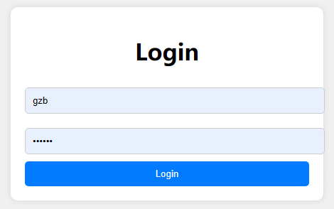
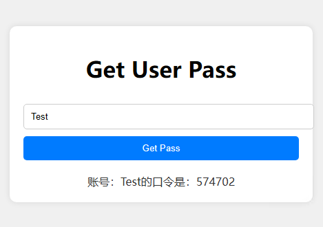
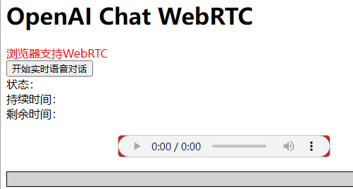

# OpenAI+webRTC实时语音对话功能开发说明

### 1. 实现方式：

1.使用Nodejs+Html页面实现。

### 2. 注意事项：

2.webRTC--必须在https协议的站点下、或者本地localhost调试情况下才可以调用使用

3.OpenAI的接口有token的数量的限制，因为账号的token调用数量的显示，普通账号不能持续的进行对话沟通。

### 3.get_openai_session.js

主程序：

/

/login --验证用户名和口令

/get_pass_by_username 得到用户口令通过用户名

/session 获取openai的临时key（实际发布时候停用）

/session_by_token  验证token后获取openai的临时key

### 4.login.html

### 5.logout.html

### 6.admin_pass.html 

注：实际发布的时候，要将此文件改名。

### 7.chat_webrtc.html

2025.01.14
